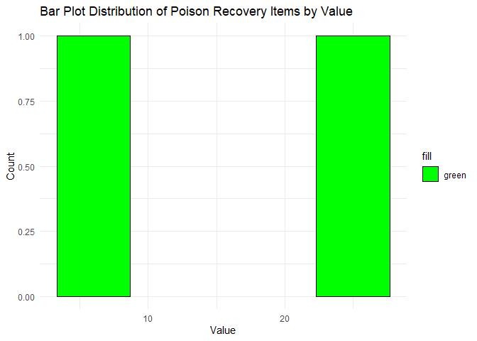
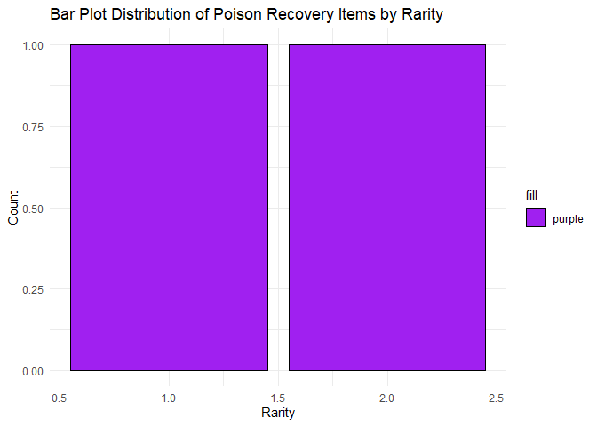
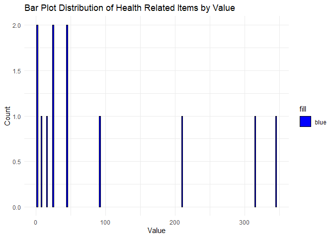
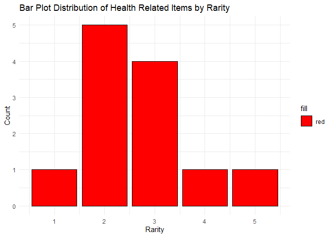
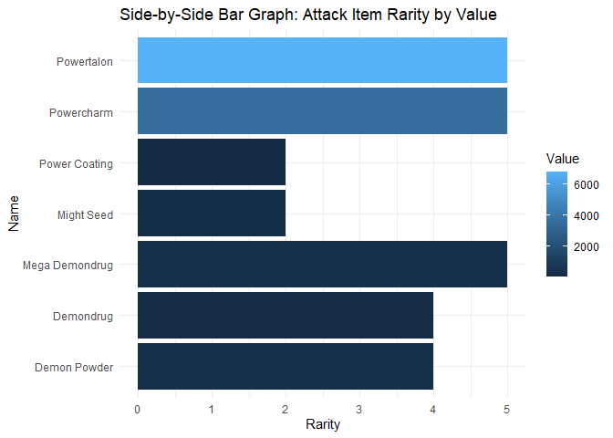
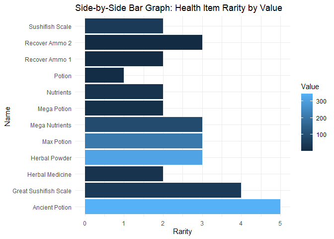
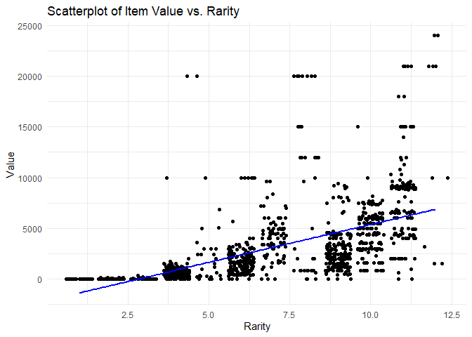
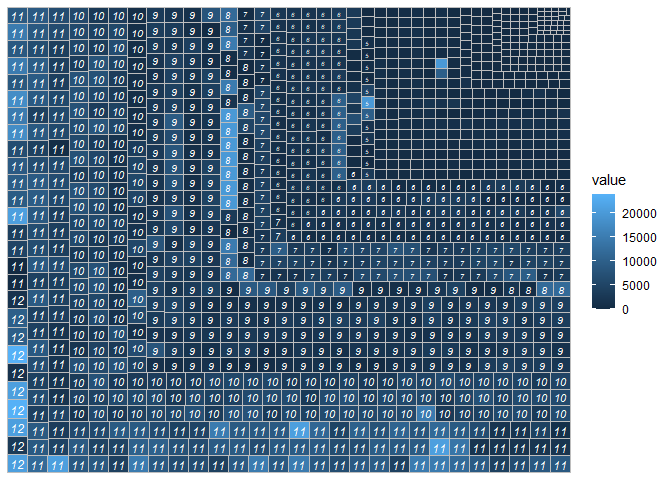

ST 558 Project 2
================
Ryan Craft
2023-10-7

# Introduction:

This document is a vignette to show how to retrieve data from an API. To
demonstrate, I have constructed functions to retrieve data from the
Monster Hunter World API (<https://docs.mhw-db.com/>). I have built
several functions to interact with some of the endpoints and explore the
retrieved data.

Some of these functions return data at item level, while others return
data at the ailment level. I have constructed the functions to take
similar arguments. Both of the main functions accept the first argument
as either the whole or part of name or description of item or ailment,
the second argument specifies if you are searching for an item or
ailment. Both arguments must be in quotes, but they are not
case-sensitive and will accept partial entries. The default for both
main functions is to retrieve all items or ailments based on the name.

# Requirements

To use the functions for interacting with the Monster Hunter World API,
I used the following packages: library(tidyverse):tons of useful
features for data manipulation and visualization library(jsonlite): API
interaction library(treemapify): allows production of tree-maps
library(ggfittext): resize the text so it fits the treemap tile
library(knitr): integrate R code and its output into documents, add
titles to table()

Loading necessary libraries to read data, manipulate data, and plot
data.

``` r
library(jsonlite)
library(tidyverse)
```

    ## ── Attaching core tidyverse packages ──────────────────────── tidyverse 2.0.0 ──
    ## ✔ dplyr     1.1.2          ✔ readr     2.1.4     
    ## ✔ forcats   1.0.0          ✔ stringr   1.5.0     
    ## ✔ ggplot2   3.4.3          ✔ tibble    3.2.1     
    ## ✔ lubridate 1.9.2          ✔ tidyr     1.3.0.9000
    ## ✔ purrr     1.0.2          
    ## ── Conflicts ────────────────────────────────────────── tidyverse_conflicts() ──
    ## ✖ dplyr::filter()  masks stats::filter()
    ## ✖ purrr::flatten() masks jsonlite::flatten()
    ## ✖ dplyr::lag()     masks stats::lag()
    ## ℹ Use the conflicted package (<http://conflicted.r-lib.org/>) to force all conflicts to become errors

``` r
library(treemapify)
library(ggfittext)
library(knitr)
```

# API Interaction Functions

Here is where I define the functions to interact with the Monster Hunter
World API.

    ailmentfunc

I wrote the ailmentfunc function to interact with the ailments endpoint
of the Monster Hunter World API. It returns a tibble containing the id,
name, description, a list of two actions, and a list of data.frames that
contain information regarding the recovery items for specific ailments.
It takes the ailmentfunc function takes two arguments, both are
non-casesensitive and the first may either be a segment of the name or
segment of the description of the ailment, and the second identifies
whether the user is providing a name or a description. Both arguments
must be in quotes. If no arguments are provided to the function, it will
default to all names of ailments.

``` r
ailmentfunc <- function(query = "all", type = "name") {
  # Fetch ailment data from the endpoint
  outputAPI <- fromJSON("https://mhw-db.com/ailments")
  
  # Convert the API's response to a tibble
  output <- as_tibble(outputAPI)
  
  # Filter based on the query type (name, description)
  if (query != "all") {
    # Convert the query to lowercase for case-insensitive matching
    query <- tolower(query)
    
    if (type == "name") {
      output <- output %>% filter(grepl(query, tolower(name)))
    } else if (type == "description") {
      output <- output %>% filter(grepl(query, tolower(description)))
    } else {
      stop("ERROR: Invalid query type. Use 'name' or 'description'.")
    }
  }

  # Check if the result is empty and throw an informative error
  if (nrow(output) == 0) {
    stop(paste("ERROR: No ailment found for the given", type, ":", query))
  }
  
  # Unnest the recovery column to create another tibble
  recovery_unnested <- output %>% unnest(cols = c(recovery))
  return(recovery_unnested)
}
```

The second main function is the itemfunc function. This function also
takes two arguments, the first either segments of the name or
description of an item and the second telling the function whether the
user is providing either a name or description. And, itemfunc defaults
to all names of objects in Monster Hunter World. The itemfunc function
returns a list of the queried items and their full descriptions in
separate data.frames, a list of the queried objects with their value,
and the average value of all queried objects.

``` r
itemfunc <- function(query = "all", type = "name") {
  # Fetch item data from the endpoint
  outputAPI <- fromJSON("https://mhw-db.com/items")
  
  # Convert the API's response to a tibble
  output <- as_tibble(outputAPI)
  
  # Filter based on the query type (name, description)
  if (query != "all") {
    # Convert the query to lowercase for case-insensitive matching
    query <- tolower(query)
    
    if (type == "name") {
      output <- output %>% filter(grepl(query, tolower(output[["name"]])))
    } else if (type == "description") {
      output <- output %>% filter(grepl(query, tolower(output[["description"]])))
    } else {
      stop("ERROR: Invalid query type. Use 'name' or 'description'.")
    }
  }
  
  # Check if the result is empty and throw an informative error
  if (nrow(output) == 0) {
    stop(paste("ERROR: No item found for the given", type, ":", query))
  }

  item_data = output
}
```

# Exploratory Data Analysis

## Research Questions:

Given the dataset obtained from the Monster Hunter World API, I am
particularly interested in understanding:

Which recovery items are most commonly used to counter various ailments?
Is there a correlation between the rarity of a recovery item and its
value? To answer these questions, I’ll employ various data visualization
and analytical techniques.

## Data Retrieval:

First, we’ll fetch data from the API using the defined functions. To
demonstrate the versatility of the itemfunc function, I will provide
only one partial first argument, “pois”, and no second argument. In
doing so, I am showing that the function has the ability to be non-case
sensitive, and that the second argument defaults to searching the name
column of the ailments data.frame. Names in the ailments data.frame are
always capitalized.

A second data.frame will also be produced from a query of “potion” from
the name column of the items data.frame.

``` r
# Fetch data for poison ailment
poison_item_data <- ailmentfunc("poison", "description")
poison_item_data <- poison_item_data[[5]][[1]]
# Fetch data for items related to health
health_item_data <- itemfunc("health", "description")
```

## Contingency Tables:

To understand which recovery items are commonly used, we can create a
contingency table. In order to provide the data required from these
dataframes, I needed to take a look at the data produced from the
queries and provide the correct index for the desired data.frame and the
correct column name for the comparison. In this table, the names will
appear as the rows and the rarity (on a 1-12 scale) will appear on the
top. We will also produce a second table that shows the names and values
of the items that provide recovery from poison with the names of the
items as the rows and the values of the items as the columns. For a look
at how these rarities and values compare to items that impact health as
a whole, we will also produce two tables looking at these variables for
all health-related items:

``` r
print("Poison Item Rarity Table")
```

    ## [1] "Poison Item Rarity Table"

``` r
table(poison_item_data$name, poison_item_data$rarity)
```

    ##                  
    ##                   1 2
    ##   Antidote        1 0
    ##   Herbal Medicine 0 1

``` r
print("Poison Item Value Table")
```

    ## [1] "Poison Item Value Table"

``` r
table(poison_item_data$name, poison_item_data$value)
```

    ##                  
    ##                   6 25
    ##   Antidote        1  0
    ##   Herbal Medicine 0  1

``` r
print("Health Item Rarity Table")
```

    ## [1] "Health Item Rarity Table"

``` r
table(health_item_data$name, health_item_data$rarity)
```

    ##                        
    ##                         1 2 3 4 5
    ##   Ancient Potion        0 0 0 0 1
    ##   Great Sushifish Scale 0 0 0 1 0
    ##   Herbal Medicine       0 1 0 0 0
    ##   Herbal Powder         0 0 1 0 0
    ##   Max Potion            0 0 1 0 0
    ##   Mega Nutrients        0 0 1 0 0
    ##   Mega Potion           0 1 0 0 0
    ##   Nutrients             0 1 0 0 0
    ##   Potion                1 0 0 0 0
    ##   Recover Ammo 1        0 1 0 0 0
    ##   Recover Ammo 2        0 0 1 0 0
    ##   Sushifish Scale       0 1 0 0 0

``` r
print("Health Item Value Table")
```

    ## [1] "Health Item Value Table"

``` r
table(health_item_data$name, health_item_data$value)
```

    ##                        
    ##                         2 8 16 25 45 92 210 315 345
    ##   Ancient Potion        0 0  0  0  0  0   0   0   1
    ##   Great Sushifish Scale 0 0  0  0  1  0   0   0   0
    ##   Herbal Medicine       0 0  0  1  0  0   0   0   0
    ##   Herbal Powder         0 0  0  0  0  0   0   1   0
    ##   Max Potion            0 0  0  0  0  0   1   0   0
    ##   Mega Nutrients        0 0  0  0  0  1   0   0   0
    ##   Mega Potion           0 0  1  0  0  0   0   0   0
    ##   Nutrients             0 0  0  1  0  0   0   0   0
    ##   Potion                0 1  0  0  0  0   0   0   0
    ##   Recover Ammo 1        1 0  0  0  0  0   0   0   0
    ##   Recover Ammo 2        1 0  0  0  0  0   0   0   0
    ##   Sushifish Scale       0 0  0  0  1  0   0   0   0

## Numerical Summaries:

Based on the contingency tables produced, it is clear that there are
many more health-related items than items that cure poison, which can be
expected. Further, the rarity and value of health items exists on a
greater scale than poison items. To make this data more digestible and
put it on a scale that allows the two categories to be more directly
compared, I will generate numerical summaries of these aspects of poison
items and health recovery items. Let’s generate some summaries of the
data:

``` r
#using the summary() function to produce numerical summaries of the data, allowing for more direct comparison of data that may have varying ranges of values
print("Poison Item Value Numerical Summary")
```

    ## [1] "Poison Item Value Numerical Summary"

``` r
summary(poison_item_data$value)
```

    ##    Min. 1st Qu.  Median    Mean 3rd Qu.    Max. 
    ##    6.00   10.75   15.50   15.50   20.25   25.00

``` r
print("Poison Item Rarity Numerical Summary")
```

    ## [1] "Poison Item Rarity Numerical Summary"

``` r
summary(poison_item_data$rarity)
```

    ##    Min. 1st Qu.  Median    Mean 3rd Qu.    Max. 
    ##    1.00    1.25    1.50    1.50    1.75    2.00

``` r
print("Health Item Value Numerical Summary")
```

    ## [1] "Health Item Value Numerical Summary"

``` r
summary(health_item_data$value)
```

    ##    Min. 1st Qu.  Median    Mean 3rd Qu.    Max. 
    ##    2.00   14.00   35.00   94.17  121.50  345.00

``` r
print("Health Item Rarity Numerical Summary")
```

    ## [1] "Health Item Rarity Numerical Summary"

``` r
summary(health_item_data$rarity)
```

    ##    Min. 1st Qu.  Median    Mean 3rd Qu.    Max. 
    ##   1.000   2.000   2.500   2.667   3.000   5.000

From looking at this data, we can see that the average value for a
health-related object in Monster Hunter World is 94.17, while the
average value for a poison-curing object is 15.50. Further, the average
rarity of a health-related object is 2.5, while the average rarity of a
poison-curing object is 1.5. This tells us that poison curing objects
are less valuable than health-related objects on average, and they are
also less rare than health-related objects on average.

## Plots

This data can be visualized using a variety of methods, including
boxplots, scatterplots, and histograms. Let’s take a look at some of
these visualizations to get a better idea of the shape of the
distribution of our data.

### Barplots

``` r
# Poison Recovery Items by Value with green bars
poison_item_value_BP <- ggplot(poison_item_data, aes(x = value, fill = "green")) +
  geom_bar(color = "black") +
  labs(title = "Bar Plot Distribution of Poison Recovery Items by Value", 
       x = "Value", 
       y = "Count") +
  scale_fill_manual(values = c("green")) +
  theme_minimal()
print(poison_item_value_BP)
```

<!-- -->

``` r
# Poison Recovery Items by Rarity with purple bars
poison_item_rarity_BP <- ggplot(poison_item_data, aes(x = rarity, fill = "purple")) +
  geom_bar(color = "black") +
  labs(title = "Bar Plot Distribution of Poison Recovery Items by Rarity", 
       x = "Rarity", 
       y = "Count") +
  scale_fill_manual(values = c("purple")) +
  theme_minimal()
print(poison_item_rarity_BP)
```

<!-- -->

``` r
# Health Related Items by Value with blue bars
health_item_value_BP <- ggplot(health_item_data, aes(x = value, fill = "blue")) +
  geom_bar(color = "black") +
  labs(title = "Bar Plot Distribution of Health Related Items by Value", 
       x = "Value", 
       y = "Count") +
  scale_fill_manual(values = c("blue")) +
  theme_minimal()
print(health_item_value_BP)
```

<!-- -->

``` r
# Health Related Items by Rarity with red bars
health_item_rarity_BP <- ggplot(health_item_data, aes(x = rarity, fill = "red")) +
  geom_bar(color = "black") +
  labs(title = "Bar Plot Distribution of Health Related Items by Rarity", 
       x = "Rarity", 
       y = "Count") +
  scale_fill_manual(values = c("red")) +
  theme_minimal()
print(health_item_rarity_BP)
```

<!-- -->

This leads us to ask, are other types of objects that are more rare also
more valuable? We can look at this through the lens of assessing the
recovery objects as well as other types of objects as a whole to see if
the trend carries throughout different categories. One way of doing this
is to create plots that allow you to directly compare different types.

### Side-by-side 2-way Barplots

``` r
attack_item_data <- itemfunc('attack', 'description')

defense_item_data <- itemfunc('attack', 'description')
```

``` r
# Create a two-way contingency table using group_by() and summarize()
attack_item_2way_rarityVvalue <- attack_item_data %>%
  group_by(name, rarity, value) %>%
  summarize(count = n())
```

    ## `summarise()` has grouped output by 'name', 'rarity'. You can override using
    ## the `.groups` argument.

``` r
print(attack_item_2way_rarityVvalue)
```

    ## # A tibble: 7 × 4
    ## # Groups:   name, rarity [7]
    ##   name           rarity value count
    ##   <chr>           <int> <int> <int>
    ## 1 Demon Powder        4   315     1
    ## 2 Demondrug           4    67     1
    ## 3 Mega Demondrug      5   283     1
    ## 4 Might Seed          2   140     1
    ## 5 Power Coating       2     2     1
    ## 6 Powercharm          5  3600     1
    ## 7 Powertalon          5  6840     1

``` r
# Create a side-by-side bar graph
attack_item_2wayplot_rarityVvalue <- ggplot(attack_item_2way_rarityVvalue, aes(x = rarity, y = name, fill = value)) +
  geom_bar(stat = "identity", position = "dodge") +
  labs(x = "Rarity", y = "Name", fill = "Value") +
  ggtitle("Side-by-Side Bar Graph: Attack Item Rarity by Value") +
  theme_minimal()

# Display the side-by-side bar graph
print(attack_item_2wayplot_rarityVvalue)
```

<!-- -->

``` r
# Create a two-way contingency table using group_by() and summarize()
health_item_2way_rarityVvalue <- health_item_data %>%
  group_by(name, rarity, value) %>%
  summarize(count = n())
```

    ## `summarise()` has grouped output by 'name', 'rarity'. You can override using
    ## the `.groups` argument.

``` r
print(health_item_2way_rarityVvalue)
```

    ## # A tibble: 12 × 4
    ## # Groups:   name, rarity [12]
    ##    name                  rarity value count
    ##    <chr>                  <int> <int> <int>
    ##  1 Ancient Potion             5   345     1
    ##  2 Great Sushifish Scale      4    45     1
    ##  3 Herbal Medicine            2    25     1
    ##  4 Herbal Powder              3   315     1
    ##  5 Max Potion                 3   210     1
    ##  6 Mega Nutrients             3    92     1
    ##  7 Mega Potion                2    16     1
    ##  8 Nutrients                  2    25     1
    ##  9 Potion                     1     8     1
    ## 10 Recover Ammo 1             2     2     1
    ## 11 Recover Ammo 2             3     2     1
    ## 12 Sushifish Scale            2    45     1

``` r
# Create a side-by-side bar graph
health_item_2wayplot_rarityVvalue <- ggplot(health_item_2way_rarityVvalue, aes(x = rarity, y = name, fill = value)) +
  geom_bar(stat = "identity", position = "dodge") +
  labs(x = "Rarity", y = "Name", fill = "Value") +
  ggtitle("Side-by-Side Bar Graph: Health Item Rarity by Value") +
  theme_minimal()

# Display the side-by-side bar graph
print(health_item_2wayplot_rarityVvalue)
```

<!-- -->

``` r
defense_item_2way_rarityVvalue <- defense_item_data %>%
  group_by(name, rarity, value) %>%
  summarize(count = n())
```

    ## `summarise()` has grouped output by 'name', 'rarity'. You can override using
    ## the `.groups` argument.

``` r
print(defense_item_2way_rarityVvalue)
```

    ## # A tibble: 7 × 4
    ## # Groups:   name, rarity [7]
    ##   name           rarity value count
    ##   <chr>           <int> <int> <int>
    ## 1 Demon Powder        4   315     1
    ## 2 Demondrug           4    67     1
    ## 3 Mega Demondrug      5   283     1
    ## 4 Might Seed          2   140     1
    ## 5 Power Coating       2     2     1
    ## 6 Powercharm          5  3600     1
    ## 7 Powertalon          5  6840     1

``` r
# Create a side-by-side bar graph
defense_item_2wayplot_rarityVvalue <- ggplot(defense_item_2way_rarityVvalue, aes(x = rarity, y = name, fill = value)) +
  geom_bar(stat = "identity", position = "dodge") +
  labs(x = "Rarity", y = "Name", fill = "Value") +
  ggtitle("Side-by-Side Bar Graph: Defense Item Rarity by Value") +
  theme_minimal()

# Display the side-by-side bar graph
print(defense_item_2wayplot_rarityVvalue)
```

<!-- -->

In these plots, we are able to look at the rarity and value of attack,
defense, and health items. By doing so, we can observe that the trend
that I had previously posited, that items that are more rare are also
more valuable does not necessarily exist across different categories of
items. This trend did appear to exist when looking at the poison
recovery items and, to some extent, health-related items and defense
items, but it is not present when looking at attack items. By looking at
these three graphs that assess rarity and value across different item
categories, it appears that there is not a consistent trend in item
value increasing along with rarity.

### Scatterplot

To get an overall look at whether this trend exists, we will make
another graph that takes a look at all items in Monster Hunter World,
plotted by their rarity on the x axis and value on the y axis. If there
is a trend here, we would expect to see a positive trend in items
increasing in value as their rarity increases

``` r
item_data <- itemfunc()
```

``` r
# Scatterplot of Item Value by Rarity
scatterplot_items <- ggplot(item_data, aes(x = rarity, y = value)) +
  geom_jitter() +
  # Add line of best fit
  geom_smooth(method = "lm", se = FALSE, color = "blue") +
  labs(x = "Rarity", y = "Value") +
  ggtitle("Scatterplot of Item Value vs. Rarity") +
  theme_minimal()
# Print the scatterplot
print(scatterplot_items)
```

    ## `geom_smooth()` using formula = 'y ~ x'

<!-- -->
Using this method, it does in fact appear that there is some level of a
positive trend between item value and item rarity. With a little
statistics elbow-grease, we can determine whether this trend is
predictive, or merely an artifact.

## Stats

``` r
# Fit a linear model
model <- lm(value ~ rarity, data = item_data)

# Extract the R^2 value from the model summary
r_squared <- summary(model)$r.squared

# Print the R^2 value
print(paste("R-squared value: ", round(r_squared, 3)))
```

    ## [1] "R-squared value:  0.335"

The r-squared value is at 0.335, indicating that there is a low-level of
correlation. With this data combined with our observations of the
graphs, it is fairly safe to say that our previous conclusion that the
trend is inconsistent and may only exist in certain item categories is
well-founded.

## Tree-map

Finally, I will utilize a different type of plotting to see if it
provides any additional information on this comparison. The type of
plotting I will use is tree-mapping. Tree-mapping is a method for
displaying hierarchical data using nested figures. Each branch of the
hierarchy is represented by a colored rectangle, which is then tiled
with smaller rectangles that represent sub-branches or leaf nodes. The
size of the rectangles typically corresponds to a quantitative
dimension, meaning larger rectangles represent larger values.

Let’s take a look at what a tree-map of the rarity of value of items
grouped by their rarities.

``` r
ggplot(item_data, aes(area = rarity, fill = value, label = rarity)) +
  geom_treemap() +
  geom_treemap_text(fontface = "italic", colour = "white", place = "centre",
                    grow = TRUE)
```

<!-- --> From this
tree-map, we can see that the weak correlation that we found from our
statistical analysis of the association between item value and rarity
can be viewed in a particularly visual manner. In that, if there was a
strong correlation between item rarity and we would be able to observe a
consistent wave in how the color changes going from light to dark.
However, we can see here that the change in color is much more random.

# Wrap-Up

To summarize the things I did in this vignette, I built functions to
interact with some of the Monster Hunter World API endpoints, retrieved
some of the data, and explored it using tables, numerical summaries, and
data visualization. I found some unsurprising things, like that within
some categories rarity of items appeared to predict the value of items.
I also found some surprising things, such as how, overall, item rarity
was a weak predictor of value.

I hope my vignette helps you interact with APIs in the future.
